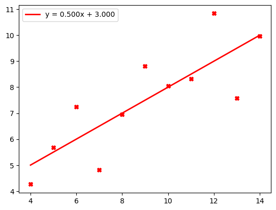
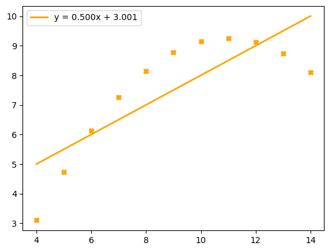
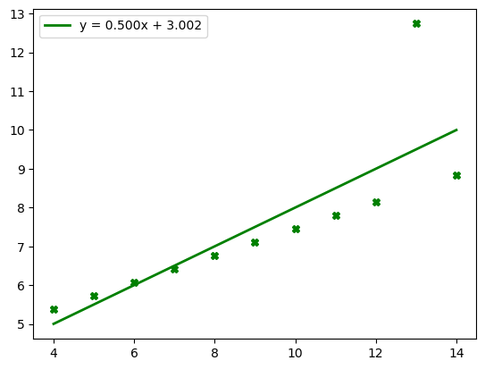
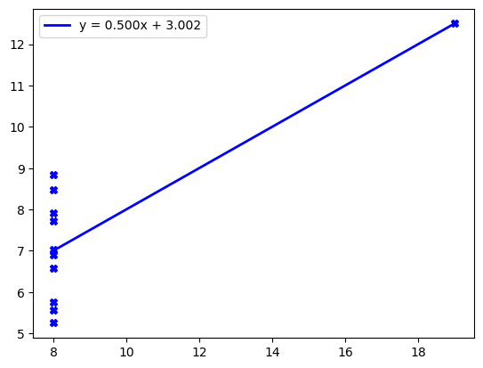

# Anscombes Quartet Exercise
Why should we visualize data?


We are given 4 different sets of data:
- **x1 & y1**
- **x2 & y2**
- **x3 & y3**
- **x4 & y4**


## Summary of Analysis & What I Did

For each dataset (**x1 & y1**, **x2 & y2**, **x3 & y3**, **x4 & y4**), the following steps were performed:
1. **Statistical Analysis**: 
    Key statistical measures such as mean, variance, and correlation were calculated to compare the dataset.
2. **Graphical Representation**
    Plotting each dataset using a scatterplot & via matplotlib's pyplot module.


The full raw data can be found below, or in .xlsx format [here](./AnscombesQuartet.xlsx)

|  x1  |  x2  |  x3  |  x4  |  y1   |  y2   |  y3   |  y4   |
|------|------|------|------|-------|-------|-------|-------|
|  10  |  10  |  10  |   8  |  8.04 |  9.14 |  7.46 |  6.58 |
|   8  |   8  |   8  |   8  |  6.95 |  8.14 |  6.77 |  5.76 |
|  13  |  13  |  13  |   8  |  7.58 |  8.74 | 12.74 |  7.71 |
|   9  |   9  |   9  |   8  |  8.81 |  8.77 |  7.11 |  8.84 |
|  11  |  11  |  11  |   8  |  8.33 |  9.26 |  7.81 |  8.47 |
|  14  |  14  |  14  |   8  |  9.96 |  8.10 |  8.84 |  7.04 |
|   6  |   6  |   6  |   8  |  7.24 |  6.13 |  6.08 |  5.25 |
|   4  |   4  |   4  |  19  |  4.26 |  3.10 |  5.39 | 12.50 |
|  12  |  12  |  12  |   8  | 10.84 |  9.13 |  8.15 |  5.56 |
|   7  |   7  |   7  |   8  |  4.82 |  7.26 |  6.42 |  7.91 |
|   5  |   5  |   5  |   8  |  5.68 |  4.74 |  5.73 |  6.89 |


Initially, I started by loading the XLSX into *pandas*.
```python
import pandas as pd

AQ: pd.DataFrame = pd.read_excel('./AnscombesQuartet.xlsx')
```

After this, I calculated a few statistical measures:

1. **Mean**
```python
# Means is a list of all the means in this order:
# [x1, x2, x3, x4, y1, y2, y3, y4]
means: list[float] = [AQ.mean(axis = 0)[i] for i in range(8)]

print(means)
```
```
Output:
[9.0, 9.0, 9.0, 9.0, 7.500909090909093, 7.50090909090909, 7.5, 7.500909090909091]
```
If we ignore the slight floating-point precision error, this tells us that the datasets are quite similar.
The x-means are all identical, and so are the y-means.

2. **Median**
We calculate median in a similar method:
```
medians: list[float] = [AQ.median(axis = 0)[i] for i in range(8)]
print(medians)
```
Output:
```
[9.0, 9.0, 9.0, 8.0, 7.58, 8.14, 7.11, 7.04]
```
The medians, although not all the exact same, are still quite close to one another. The x-values have identical medians except for **x4**, which has a slightly lower median of 8.0. Similarly, the y-values show slight variations, with **y1** and **y2** having higher medians compared to **y3** and **y4**.


All data sets, **y1**, **y2**, **y3**, and **y4**, when graphed, seem different initially.


  


  



However, things start to change when calculating some statistics.

